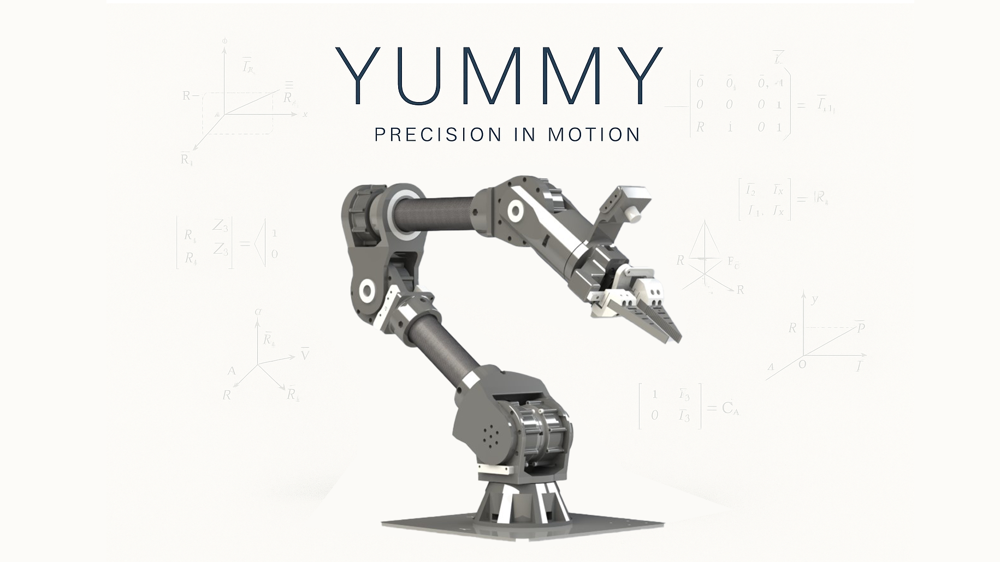
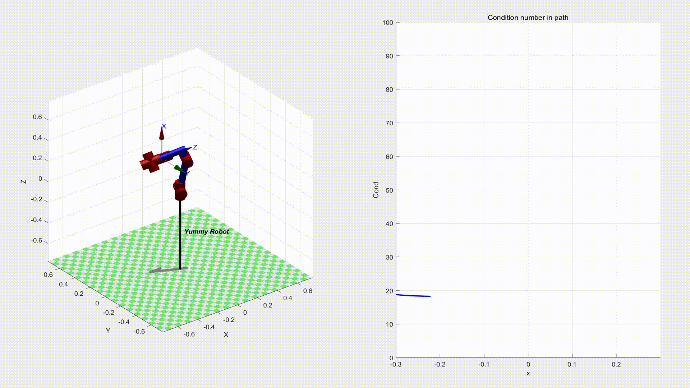
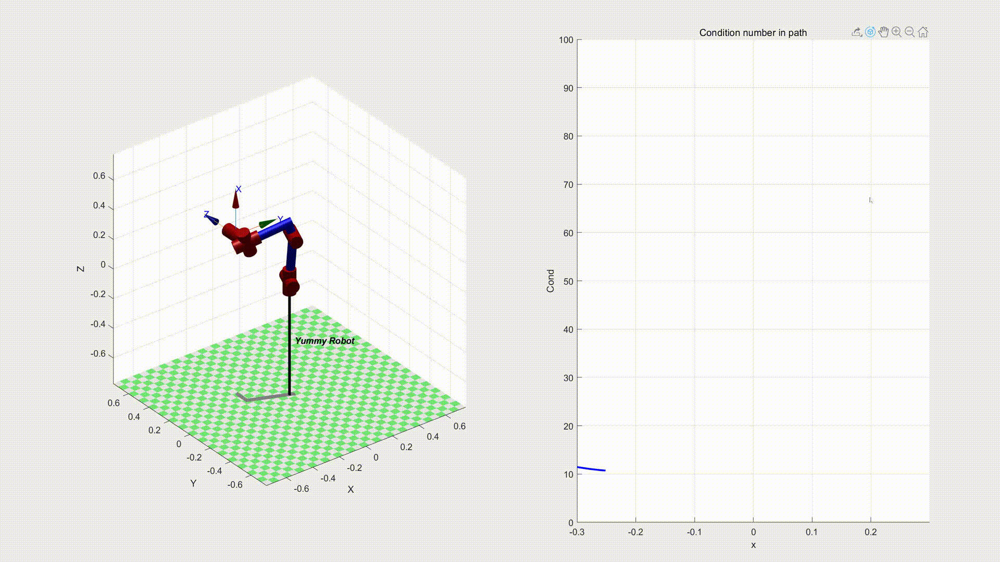

# YummyRobotics

|              工作空间              |          逆运动学           |
| :--------------------------------: | :-------------------------: |
|  |  |

雅可比矩阵条件数检测运动路径奇异点：

# 特别感谢

- 感谢李金珈同学在结构设计上的帮助
