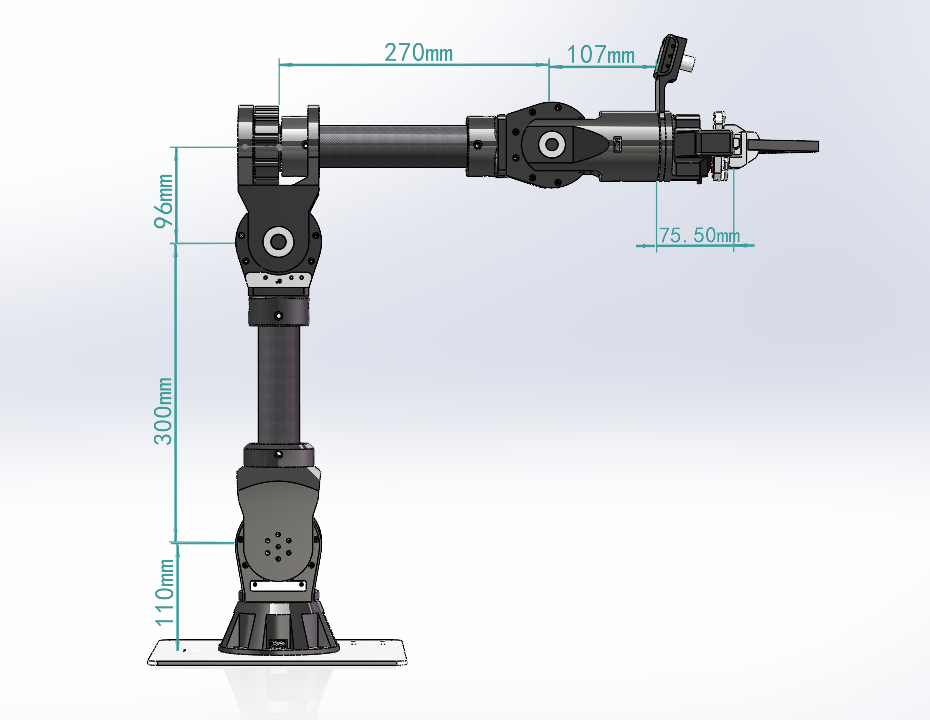
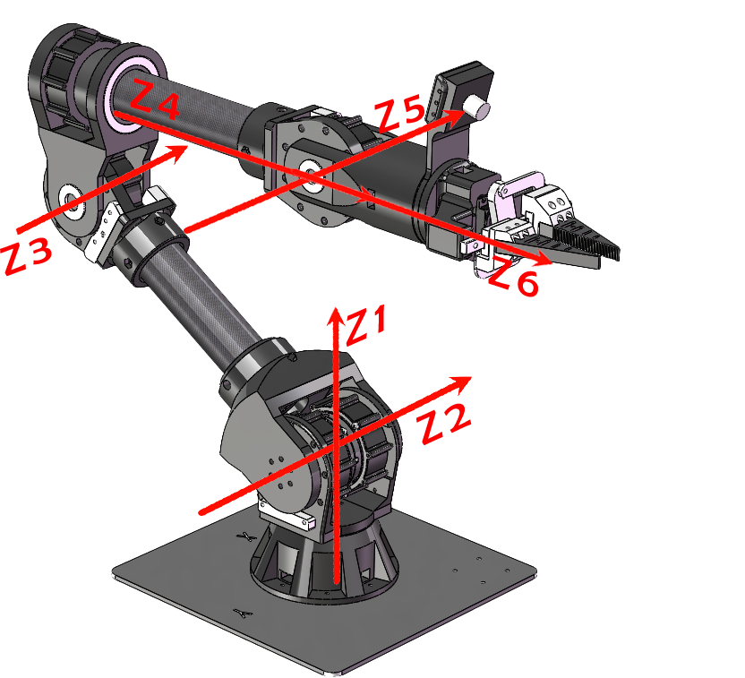
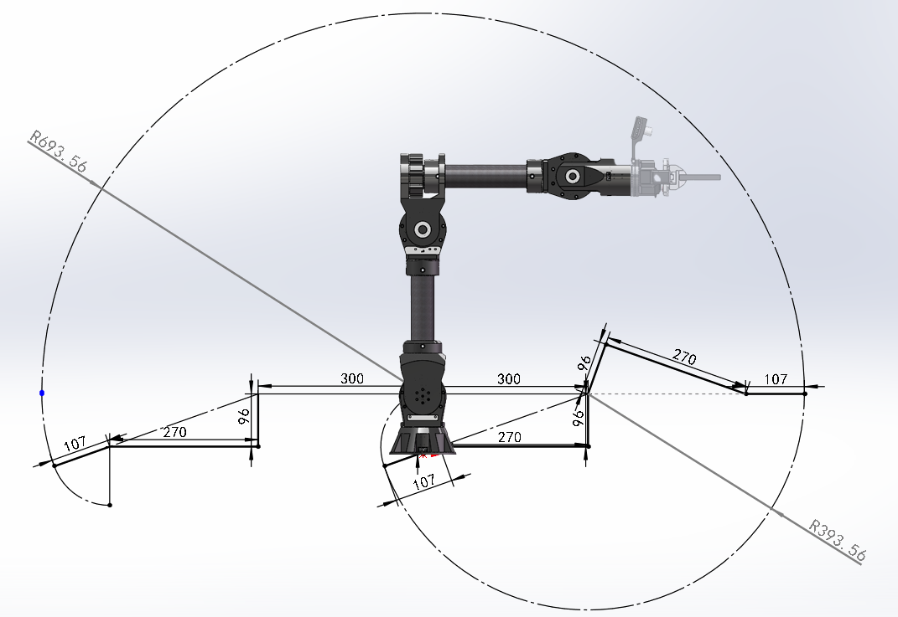
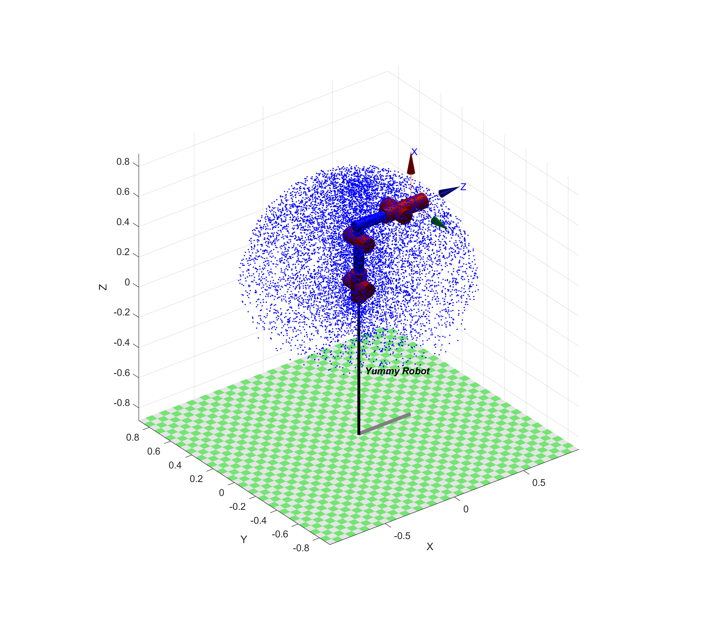
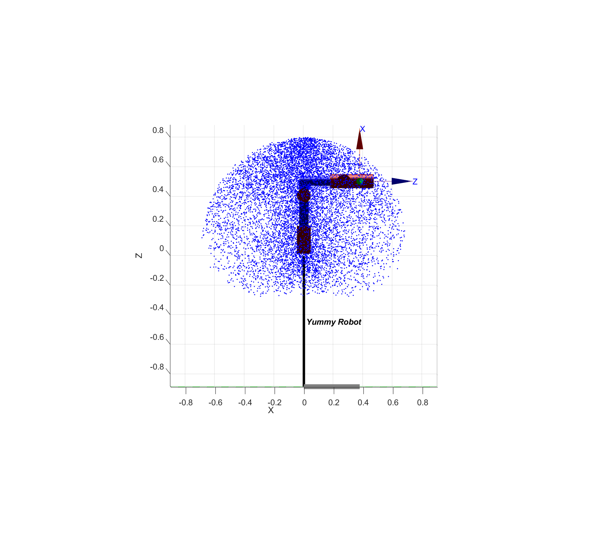
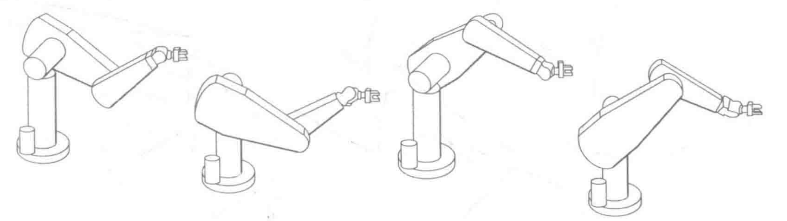
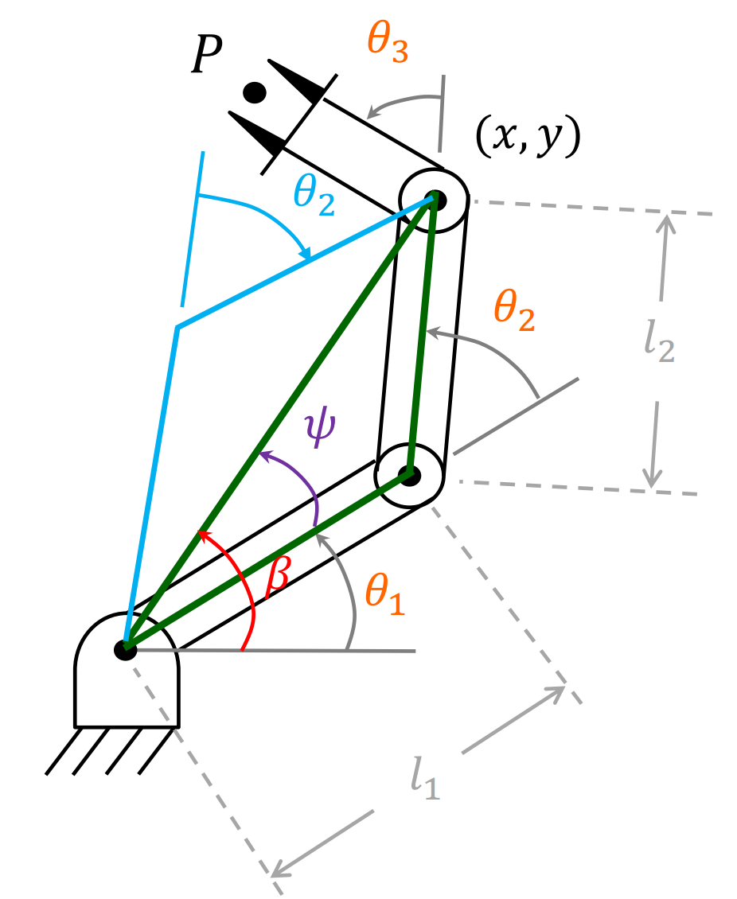

# Yummy Robot Development Notes

## 机械臂模型（MDH）

|  |  |
| ----------------------------------- | :------------------------------------------: |

​	机械臂设计符合Pieper判据，即相邻的三个关节轴相交于一点，根据改进DH法可得：

| $i$ | $\theta_i$ | $d_i(m)$ | $a_{i-1}(m)$ | $\alpha_{i-1}(rad)$ |
| :---: | :--: | :--: | :--: | :------: |
| 1 | $\theta_1$      | 0 | 0 | 0 |
| 2 |$\theta_2$      | 0 | 0 | $\alpha_1=\pi/2$ |
| 3 |$\theta_3$       | 0 | $a_2=$0.3 | 0 |
| 4 |$\theta_4$      | 0.27 | $a_3=$0.096 | $\alpha_3=\pi/2$ |
| 5 | $\theta_5$     | 0 | 0 | $\alpha_4=-\pi/2$ |
| 6 | $\theta_6$      | 0.107 | 0 | $\alpha_5=\pi/2$ |

## 工作空间

​	使用MATLAB，对机械臂蒙特卡洛采样法可建立笛卡尔空间坐标系下的可视范围：

|  |  |
| ----------------------------------- | ------------------------------------ |

## 正运动学

## 逆运动学

### 逆解分析

#### 机械臂逆解的个数

​	串联机械臂的逆运动学问题求解相比正运动学复杂度更高，对于6自由度机械臂来说，在逆运动学问题分析过程中需要对**齐次变换矩阵**中的相互独立的6个非线性超越方程进行求解。该方程有6个未知量，其解的存在性以及解的个数由机械臂的**运动学结构**、**目标点是否位于灵活工作空间**以及**程序中队关节限制**而决定的。

在存在可行解的情况下，其个数不唯一，对于6自由度机械臂而言，最多可能存在16个解，解的个数与DH参数中的a（连杆长度）有关：

| $a_i$           | 逆解个数 |
| --------------- | -------- |
| $a_1=a_3=a_5=0$ | $\leq4$ |
|$a_3=a_5=0$|$\leq8$|
|$a_3=0$|$\leq16$|
|All $a_i\neq0$|$\leq16$|

​	对于满足pieper判据的6自由度机器人来说，其后三轴相交于一点，可看作一个球型的腕关节，其前三个关节和后三个关节可以相互解耦，由下图可以看出前三轴决定了腕关节点空间中的位置，而后三个关节则是空间中的旋转方向，前三关节有以下4种情况，而整个腕关节一般有正反两种情况（J4,J6反转互补），因此一共有8种解。

#### 机械臂逆解类型

​	机械臂逆运动学分为**封闭解法**和**数值解法**，封闭解法通过解析方式求封闭解，分为**代数法**和**几何法**得到的解称为解析解；数值法通过**迭代求解**，速度较慢

#### Pieper判据

**判断机械臂是否存在解析解**

​	在求解机械臂逆运动学前判断其解的存在性非常重要。现有研究表明，**所有的串联6自由度机械臂均是可解的**，但是这种解只能通过数值解法得到，计算难度大，复杂度高。因此在确定逆运动学解法前，需要探究机械臂逆运动学问题是否存在解析解，Pieper判据是机器人领域常用的一种判断解析解是否存在的判据。

​	**Pipper判据：6自由度机械臂存在解析解的充分条件是相邻的三个关节旋转轴相交于一点**

### 机械臂逆解求解

#### 简易机械臂通用求解

##### 几何法：

​	逆运动学就是根据设定的笛卡尔空间位姿反求关节空间中的各个关节的角度，如上图所示，我们设定目标位置$(x,y)$和最后一共关节的朝向角度$\phi$，通过三角函数求解$\theta_1,\theta_2,\theta_3$。

​	我们首先连接两点构建一个三角形，可以用余弦定理求解$\theta_2$(橙色)：

$$
x^2+y^2=l_1^2+l_2^2-2l_1l_2cos(180-\theta_2)
$$

​	我们便可以表示出：
$$
cos(\theta_2)=\frac{x^2+y^2-l_1^2-l_2^2}{2l_1l_2}
$$
​	我们再利用另一个内角$\psi$，使用余弦定理：
$$
cos(\psi)=\frac{l_2^2-(x^2+y^2)-l_1^2}{-2l_1\sqrt{x^2+y^2}}
$$
​	由于$\psi$是三角形内角所以满足$0<\psi<180$，我们可以通过$\psi$求解$\theta_1$，但这个时候出现了如上图所示多解的情况：
$$
\theta_1=
\begin{cases} 
\beta+\psi & \theta_2<0 \\
\beta-\psi & \theta_2>0
\end{cases}
$$
$$
\theta_1=
\begin{cases} 
atan2(y,x)+\psi & \theta_2<0 \\
atan2(y,x)-\psi & \theta_2>0
\end{cases}
$$
​	（相对角度逆时针为正，顺时针为负）

​	最后设定角度$\phi$为三个角度加和：
$$
\theta_1+\theta_2+\theta_3=\phi
$$
​	便可求解出$\theta_3$:
$$
\theta_3=\phi-\theta_1-\theta_2
$$

##### 代数解法：

​	根据连杆参数很容易求得这个机械臂的运动学方程：
$$
T_W^B = T_3^0
\begin{bmatrix}

c_{123} & -s_{123} & 0 &l_1c_1+l_2c_{12}\\
s_{123} & c_{123}  & 0 &l_1s_1+l_2s_{12}\\
0 & 0 & 1 & 0\\
0 & 0 & 0 & 1
\end{bmatrix}
$$
​	其中：
$$
c_{123}=cos(\theta_1+\theta_2+\theta_3)
$$

​	同几何法一样，我们设定目标位置$(x,y)$和$\phi$，同样可以得出变换矩阵：
$$
^B_WT=
\begin{bmatrix}

c_{\phi} & -s_{\phi} & 0 & x \\
s_{\phi} &  c_{\phi} & 0 & y \\
0 & 0 & 1 & 0\\
0 & 0 & 0 & 1

\end{bmatrix}
$$
​	所有的可达点都要位于上式的子空间中，令上下两式子相等，可以求得4个非线性方程：
$$
c_{\phi}=& c_{123}    &&\text{(1)}\\
s_{\phi}=& s_{123}    &&\text{(2)}\\
x =& l_1c_1+l_2c_{12} &&\text{(3)}\\
y =& l_1s_1+l_2s_{12} &&\text{(4)}\\
$$
​	$(3)$、$(4)$同时平方然后相加得：
$$
x^2+y^2=l_1^2+l_2^2+2l_1l_2c_2
$$

​	便可求解出$c_2$:
$$
c_2=\frac{x^2+y^2-l_1^2-l_2^2}{2l_1l_2}
$$

​	上述有解的条件是右边的值必须在$[-1,1]$。这个约束可以用来检查解是否存在，若约束条件不满足，则目标点位置太原，操作臂不可达。

​	假定目标点在工作空间中，$s_2$表达式为：
$$
s_2=\pm\sqrt{1-c_2^2}
$$
​	最后应用双变量反正切公式计算$\theta_2$，得：
$$
\theta_2=Atan2(s_2,c_2)
$$
​	上式的正负号选择应用于多解，可以选择“肘部朝上”或“肘部朝下”，在确定$\theta_2$时，应用循环方法求解运动学参数，先确定期望关节角的正弦和余弦，然后应用双变量反正切公式的方法。这样我们确保得出所有的解，且所求的角度是在适当的象限里。

​	求出了$\theta_2$可以根据$(3)(4)$式求出$\theta_1$，可以将$(3)(4)$写成以下形式：
$$
x=k_1c_1-k_2s_1 \\
y=k_1s_1+k_2c_1
$$
​	其中：
$$
\begin{alignat}{2}
&k_1=&&l_1+l_2c_2 \\
&k_2=&&l_2s_2
\end{alignat}
$$
​	为了求解这种形式的方程，可进行变量代换，实际上就是改变常数$k_1$和$k_2$的形式

​	令
$$
\begin{alignat}{2}
&r=+\sqrt{k_1^2+k_2^2} \\
&\gamma=Atan2(k_2,k_1)
\end{alignat}
$$
​	则：
$$
k_1=rcos\gamma \\
k_2=rsin\gamma
$$
​	因此可改写为：
$$
\frac{x}{r}=cos\gamma cos\theta_1 - sin\gamma sin\theta_1\\

\frac{y}{r}=cos\gamma sin\theta_1 + sin\gamma cos\theta_1
$$
​	进而可得：
$$
cos(\gamma+theta_1)=\frac{x}{r} \\
sin(\gamma+theta_1)=\frac{y}{r}
$$
​	利用反正切公式可得：
$$
\gamma+\theta_1=Atan2(\frac{y}{r},\frac{x}{r})=Atan2(y,x)
$$
​	从而
$$
\theta_1=Atan2(y,x)-Atan2(k_2,k_1)
$$
​	注意，$\theta_2$符号的选取也将导致$k_2$符号的变化，因此影响到$\theta_1$。利用万能公式进行变化求解的方法经常出现在运动学求解过程中。

​	最后可由$\theta_1,\theta_2,\theta_3$的和：
$$
\theta_1+\theta_2+\theta_3=Atan2(s_{\phi},c_{\phi})=\phi
$$
​	得出$\theta_3$:
$$
\theta_3=\phi-\theta_1-\theta_2
$$

#### 三轴相交的Pieper解法

​	尽管一般的6自由度机器人没有封闭解，但是在某些特殊情况下还是可解的。本项目中机械臂也是按照Pieper判据设计，即三个连续轴相交于一点的6自由度操作臂，（包括具有3个连续平行轴的机械臂，可以认为交点在无穷远处）Pieper也提出了针对6个旋转关节且后面3个轴相交的操作臂的逆运动学求解方法。

​	当最后的三个轴相交时，连杆坐标系{4}、{5}、{6}的原点均位于这个交点上：

​	这点在基坐标系中的位置是：
$$
^0P_{4ORG}=^0_1T ^1_2T ^2_3T ^3P_{4ORG}=
\begin{bmatrix}
x\\y\\z\\1
\end{bmatrix}
$$
​	在MDH下，我们可以用下式表示相邻两个关节间的变换关系：
$$
^{i-1}_iT =
\begin{bmatrix}

c\theta_i & -s\theta_i & 0 & a_{i-1} \\
s\theta_i c\alpha_{i-1} & c\theta_i c\alpha_{i-1} & -s\alpha_{i-1} & -s\alpha_{i-1}d_i \\
s\theta_i s\alpha_{i-1} & c\theta_i s\alpha_{i-1} & c\alpha_{i-1} & c\alpha_{i-1}d_i \\
0 & 0 & 0 & 1

\end{bmatrix}
$$
​	当$i=4$时，第四列即为$^3P_{4ORG}$，则上式可化为：
$$
^0P_{4ORG}=^0_1T ^1_2T ^2_3T
\begin{bmatrix}
a_3 \\ -d_4s\alpha_3 \\d_4c\alpha_3 \\1
\end{bmatrix}
$$
​	在$^{i-1}_iT$中，除了$\theta_i$是需要求解的量，其余全都可以是DH参数已经确定的，因此每个$^{i-1}_i T$都可看作关于$\theta_i$的函数：
$$
^0P_{4ORG}=^0_1T ^1_2T 
\begin{bmatrix}
f_1(\theta_3) \\
f_2(\theta_3) \\
f_3(\theta_3) \\
1
\end{bmatrix}
$$
​	其中：
$$
\begin{bmatrix}
f_1(\theta_3) \\
f_2(\theta_3) \\
f_3(\theta_3) \\
1
\end{bmatrix}
=^2_3T
\begin{bmatrix}
a_3 \\ -d_4s\alpha_3 \\d_4c\alpha_3 \\1
\end{bmatrix}
$$
​	展开得出$f_1,f_2,f_3$：
$$
\begin{align}
\MoveEqLeft 
f_1=a_3c_3 + d_4s\alpha_3s_3+a_2\\

f_2=&a_3c\alpha_2s_3 - d_4s\alpha_3c\alpha_2c_3 -d_4s\alpha_2c\alpha_3-d_3s\alpha_2 \\

f_3=&a_3s\alpha_2s_3-d_4s\alpha_3s\alpha_2c_3+d_4c\alpha_2c\alpha_3+d_3c\alpha_2
\end{align}
$$
​	看起来复杂，但是代入本项目中的参数后为：
$$
\begin{alignat}{2}
&f_1=&&0.096*c_3+0.27s_3+0.3 \\
&f_2=&&0.096*s_3-0.27*c_3-0.27 \\
&f_3=&&0
\end{alignat}
$$
​	同样地，我们对$^0_1T,^1_2T$应用变换得：
$$
^0P_{4ORG}=
\begin{bmatrix}
c_1g_1-s_1g_2 \\
s_1g_1+c_1g_2 \\
g_3 \\
1 \tag{1}
\end{bmatrix}
$$
​	其中：
$$
\begin{alignat}{2}
&g_1=c_2f_1-s_2f_2+a_1 \\
&g_2=s_2c\alpha_1f_1+c_2c\alpha_1f_2-s\alpha_1f_3-d_2s\alpha_1 \\

&g_3=s_2s\alpha_1f_1+c_2s\alpha_1f_2-c\alpha_1f_3-d_2c\alpha_1 \\
\end{alignat}
$$
​	其中值得注意的是$^0_1T$只有旋转矩阵部分，平移向量为0，因为按照MDH的坐标系建立方法两者坐标系在同一个点上。

​	现在写出$^0P_{4ORG}$绝对值平方的表达式，这里$r=x^2+y^2+z^2$：
$$
r=g_1^2+g_2^2+g_3^2
$$
​	展开得：
$$
r=f_1^2+f_2^2+f_3^2+a_1^2+d_2^2+2d_2f_3+2a_1(c_2f_1-s_2f_2)
$$
​	现在，写出Z方向的分量，可化为以下两个方程：
$$
r=(k_1c_2+k_2s_2)2a_1+k_3 \\
z=(k_1s_2-k_2c_2)s\alpha_1+k_4 \tag{2}
$$
​	其中：
$$
\begin{alignat}{2}
&k_1=f_1 \\
&k_2=-f_2 \\
&k_3=f_1^2+f_2^2+f_3^2+a_1^2+d_2^2+2d_2f_3 \\
&k_4=f_3c\alpha_1+d_2c\alpha_1
\end{alignat}
$$
​	上式消去了因变量$\theta_1$，并且因变量$\theta_2$的关系式简单。

现讨论如何求解$\theta_3$，分三种情况：

1. 若$a_1=0$，则$r=k_3$，这里r是已知的。右边（$k_3$）仅是关于$\theta_3$的函数。代入下式：
   $$
   u=tan\frac{\theta}{2} \\
   cos\theta=\frac{1-u^2}{1+u^2} \tag{*}
   $$
   由包含$tan\frac{\theta_3}{2}$的二次方程可以解出$\theta_3$。
2. 若$s\alpha_1=0$，则$z=k_4$，这里$z$是已知的，再次代入(*)式后，利用上面的一元二次方程可以解出$\theta_3$。
3. 否则，从式(2)中消去$s_2$和$c_2$，得到：
   $$
   \frac{(r-k_3)^2}{4a_1^2}+\frac{(z-k_4)^2}{s^2\alpha_1}=k_1^2+k_2^2
   $$
   再次代入(*)式，可以得到一个4次方程，由此可解出$\theta_3$。

#### 末端角度解算

