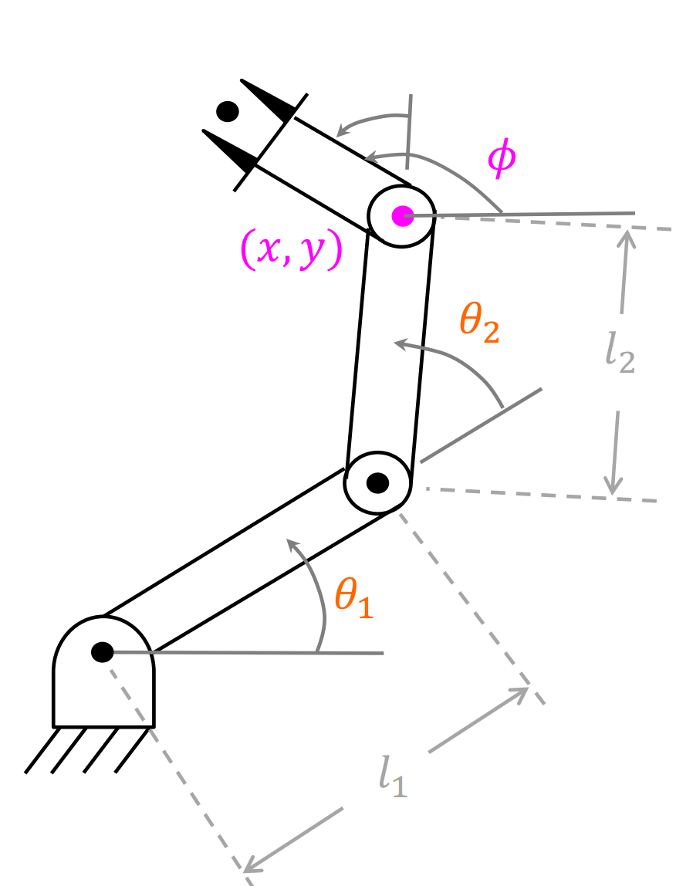
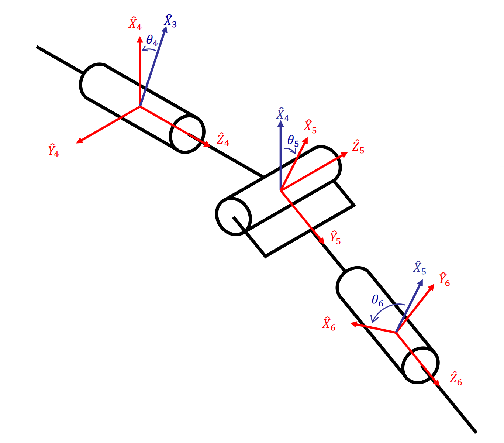

# Yummy Robot Development Notes

## 机械臂模型（MDH）

|  |  |
| ----------------------------------- | :------------------------------------------: |

​	机械臂设计符合Pieper判据，即相邻的三个关节轴相交于一点，根据改进DH法可得：

| $i$ | $\theta_i$ | $d_i(m)$ | $a_{i-1}(m)$ | $\alpha_{i-1}(rad)$ |
| :---: | :--: | :--: | :--: | :------: |
| 1 | $\theta_1$      | 0 | 0 | 0 |
| 2 |$\theta_2$      | 0 | 0 | $\alpha_1=\pi/2$ |
| 3 |$\theta_3$       | 0 | $a_2=$0.3 | 0 |
| 4 |$\theta_4$      | 0.27 | $a_3=$0.096 | $\alpha_3=\pi/2$ |
| 5 | $\theta_5$     | 0 | 0 | $\alpha_4=-\pi/2$ |
| 6 | $\theta_6$      | 0.107 | 0 | $\alpha_5=\pi/2$ |

## 工作空间

​	使用MATLAB，对机械臂蒙特卡洛采样法可建立笛卡尔空间坐标系下的可视范围：

|  |  |
| ----------------------------------- | ------------------------------------ |

## 正运动学

正运动学就是通过各个关节的角度和连杆间的变换关系解算出末端的位姿
$$
^0T_6 =
\begin{bmatrix}
n_x & o_x & a_x & p_x \\
n_y & o_y & a_y & p_y \\
n_z & o_z & a_z & p_z \\
0   & 0   & 0   & 1
\end{bmatrix}
=
^0T_1(\theta_1) ^1T_2(\theta_2) ^2T_3(\theta_3) ^3T_4(\theta_4) ^4T_5(\theta_5) ^5T_6(\theta_6)
$$

相邻两关节之间的变换：
$$
^{i-1}_iT =
\begin{bmatrix}

c\theta_i & -s\theta_i & 0 & a_{i-1} \\
s\theta_i c\alpha_{i-1} & c\theta_i c\alpha_{i-1} & -s\alpha_{i-1} & -s\alpha_{i-1}d_i \\
s\theta_i s\alpha_{i-1} & c\theta_i s\alpha_{i-1} & c\alpha_{i-1} & c\alpha_{i-1}d_i \\
0 & 0 & 0 & 1

\end{bmatrix}
$$

## 逆运动学

### 逆解分析

#### 机械臂逆解的个数

​	串联机械臂的逆运动学问题求解相比正运动学复杂度更高，对于6自由度机械臂来说，在逆运动学问题分析过程中需要对**齐次变换矩阵**中的相互独立的6个非线性超越方程进行求解。该方程有6个未知量，其解的存在性以及解的个数由机械臂的**运动学结构**、**目标点是否位于灵活工作空间**以及**程序中队关节限制**而决定的。

在存在可行解的情况下，其个数不唯一，对于6自由度机械臂而言，最多可能存在16个解，解的个数与DH参数中的a（连杆长度）有关：

| $a_i$           | 逆解个数 |
| --------------- | -------- |
| $a_1=a_3=a_5=0$ | $\leq4$ |
|$a_3=a_5=0$|$\leq8$|
|$a_3=0$|$\leq16$|
|All $a_i\neq0$|$\leq16$|

​	对于满足pieper判据的6自由度机器人来说，其后三轴相交于一点，可看作一个球型的腕关节，其前三个关节和后三个关节可以相互解耦，由下图可以看出前三轴决定了腕关节点空间中的位置，而后三个关节则是空间中的旋转方向，前三关节有以下4种情况，而整个腕关节一般有正反两种情况（J4,J6反转互补），因此一共有8种解。

#### 机械臂逆解类型

​	机械臂逆运动学分为**封闭解法**和**数值解法**，封闭解法通过解析方式求封闭解，分为**代数法**和**几何法**得到的解称为解析解；数值法通过**迭代求解**，速度较慢

#### Pieper判据

**判断机械臂是否存在解析解**

​	在求解机械臂逆运动学前判断其解的存在性非常重要。现有研究表明，**所有的串联6自由度机械臂均是可解的**，但是这种解只能通过数值解法得到，计算难度大，复杂度高。因此在确定逆运动学解法前，需要探究机械臂逆运动学问题是否存在解析解，Pieper判据是机器人领域常用的一种判断解析解是否存在的判据。

​	**Pipper判据：6自由度机械臂存在解析解的充分条件是相邻的三个关节旋转轴相交于一点**

### 机械臂逆解求解

#### 简易机械臂通用求解

##### 几何法：

​	逆运动学就是根据设定的笛卡尔空间位姿反求关节空间中的各个关节的角度，如上图所示，我们设定目标位置$(x,y)$和最后一共关节的朝向角度$\phi$，通过三角函数求解$\theta_1,\theta_2,\theta_3$。

​	我们首先连接两点构建一个三角形，可以用余弦定理求解$\theta_2$(橙色)：

$$
x^2+y^2=l_1^2+l_2^2-2l_1l_2cos(180-\theta_2)
$$

​	我们便可以表示出：
$$
cos(\theta_2)=\frac{x^2+y^2-l_1^2-l_2^2}{2l_1l_2}
$$
​	我们再利用另一个内角$\psi$，使用余弦定理：
$$
cos(\psi)=\frac{l_2^2-(x^2+y^2)-l_1^2}{-2l_1\sqrt{x^2+y^2}}
$$
​	由于$\psi$是三角形内角所以满足$0<\psi<180$，我们可以通过$\psi$求解$\theta_1$，但这个时候出现了如上图所示多解的情况：
$$
\theta_1=
\begin{cases} 
\beta+\psi & \theta_2<0 \\
\beta-\psi & \theta_2>0
\end{cases}
$$
$$
\theta_1=
\begin{cases} 
atan2(y,x)+\psi & \theta_2<0 \\
atan2(y,x)-\psi & \theta_2>0
\end{cases}
$$
​	（相对角度逆时针为正，顺时针为负）

​	最后设定角度$\phi$为三个角度加和：
$$
\theta_1+\theta_2+\theta_3=\phi
$$
​	便可求解出$\theta_3$:
$$
\theta_3=\phi-\theta_1-\theta_2
$$

##### 代数解法：

​	根据连杆参数很容易求得这个机械臂的运动学方程：
$$
T_W^B = T_3^0
\begin{bmatrix}

c_{123} & -s_{123} & 0 &l_1c_1+l_2c_{12}\\
s_{123} & c_{123}  & 0 &l_1s_1+l_2s_{12}\\
0 & 0 & 1 & 0\\
0 & 0 & 0 & 1
\end{bmatrix}
$$
​	其中：
$$
c_{123}=cos(\theta_1+\theta_2+\theta_3)
$$

​	同几何法一样，我们设定目标位置$(x,y)$和$\phi$，同样可以得出变换矩阵：
$$
^B_WT=
\begin{bmatrix}

c_{\phi} & -s_{\phi} & 0 & x \\
s_{\phi} &  c_{\phi} & 0 & y \\
0 & 0 & 1 & 0\\
0 & 0 & 0 & 1

\end{bmatrix}
$$
​	所有的可达点都要位于上式的子空间中，令上下两式子相等，可以求得4个非线性方程：
$$
c_{\phi}=& c_{123}    &&\text{(1)}\\
s_{\phi}=& s_{123}    &&\text{(2)}\\
x =& l_1c_1+l_2c_{12} &&\text{(3)}\\
y =& l_1s_1+l_2s_{12} &&\text{(4)}\\
$$
​	$(3)$、$(4)$同时平方然后相加得：
$$
x^2+y^2=l_1^2+l_2^2+2l_1l_2c_2
$$

​	便可求解出$c_2$:
$$
c_2=\frac{x^2+y^2-l_1^2-l_2^2}{2l_1l_2}
$$

​	上述有解的条件是右边的值必须在$[-1,1]$。这个约束可以用来检查解是否存在，若约束条件不满足，则目标点位置太原，操作臂不可达。

​	假定目标点在工作空间中，$s_2$表达式为：
$$
s_2=\pm\sqrt{1-c_2^2}
$$
​	最后应用双变量反正切公式计算$\theta_2$，得：
$$
\theta_2=Atan2(s_2,c_2)
$$
​	上式的正负号选择应用于多解，可以选择“肘部朝上”或“肘部朝下”，在确定$\theta_2$时，应用循环方法求解运动学参数，先确定期望关节角的正弦和余弦，然后应用双变量反正切公式的方法。这样我们确保得出所有的解，且所求的角度是在适当的象限里。

​	求出了$\theta_2$可以根据$(3)(4)$式求出$\theta_1$，可以将$(3)(4)$写成以下形式：
$$
x=k_1c_1-k_2s_1 \\
y=k_1s_1+k_2c_1
$$
​	其中：
$$
\begin{alignat}{2}
&k_1=&&l_1+l_2c_2 \\
&k_2=&&l_2s_2
\end{alignat}
$$
​	为了求解这种形式的方程，可进行变量代换，实际上就是改变常数$k_1$和$k_2$的形式

​	令
$$
\begin{alignat}{2}
&r=+\sqrt{k_1^2+k_2^2} \\
&\gamma=Atan2(k_2,k_1)
\end{alignat}
$$
​	则：
$$
k_1=rcos\gamma \\
k_2=rsin\gamma
$$
​	因此可改写为：
$$
\frac{x}{r}=cos\gamma cos\theta_1 - sin\gamma sin\theta_1\\

\frac{y}{r}=cos\gamma sin\theta_1 + sin\gamma cos\theta_1
$$
​	进而可得：
$$
cos(\gamma+theta_1)=\frac{x}{r} \\
sin(\gamma+theta_1)=\frac{y}{r}
$$
​	利用反正切公式可得：
$$
\gamma+\theta_1=Atan2(\frac{y}{r},\frac{x}{r})=Atan2(y,x)
$$
​	从而
$$
\theta_1=Atan2(y,x)-Atan2(k_2,k_1)
$$
​	注意，$\theta_2$符号的选取也将导致$k_2$符号的变化，因此影响到$\theta_1$。利用万能公式进行变化求解的方法经常出现在运动学求解过程中。

​	最后可由$\theta_1,\theta_2,\theta_3$的和：
$$
\theta_1+\theta_2+\theta_3=Atan2(s_{\phi},c_{\phi})=\phi
$$
​	得出$\theta_3$:
$$
\theta_3=\phi-\theta_1-\theta_2
$$

#### 三轴相交的Pieper解法

​	尽管一般的6自由度机器人没有封闭解，但是在某些特殊情况下还是可解的。本项目中机械臂也是按照Pieper判据设计，即三个连续轴相交于一点的6自由度操作臂，（包括具有3个连续平行轴的机械臂，可以认为交点在无穷远处）Pieper也提出了针对6个旋转关节且后面3个轴相交的操作臂的逆运动学求解方法。

​	当最后的三个轴相交时，连杆坐标系{4}、{5}、{6}的原点均位于这个交点上：

​	这点在基坐标系中的位置是：
$$
^0P_{4ORG}=^0_1T ^1_2T ^2_3T ^3P_{4ORG}=
\begin{bmatrix}
x\\y\\z\\1
\end{bmatrix}
$$
​	在MDH下，我们可以用下式表示相邻两个关节间的变换关系：
$$
^{i-1}_iT =
\begin{bmatrix}

c\theta_i & -s\theta_i & 0 & a_{i-1} \\
s\theta_i c\alpha_{i-1} & c\theta_i c\alpha_{i-1} & -s\alpha_{i-1} & -s\alpha_{i-1}d_i \\
s\theta_i s\alpha_{i-1} & c\theta_i s\alpha_{i-1} & c\alpha_{i-1} & c\alpha_{i-1}d_i \\
0 & 0 & 0 & 1

\end{bmatrix}
$$
​	当$i=4$时，第四列即为$^3P_{4ORG}$，则上式可化为：
$$
^0P_{4ORG}=^0_1T ^1_2T ^2_3T
\begin{bmatrix}
a_3 \\ -d_4s\alpha_3 \\d_4c\alpha_3 \\1
\end{bmatrix}
$$
​	在$^{i-1}_iT$中，除了$\theta_i$是需要求解的量，其余全都可以是DH参数已经确定的，因此每个$^{i-1}_i T$都可看作关于$\theta_i$的函数：
$$
^0P_{4ORG}=^0_1T ^1_2T 
\begin{bmatrix}
f_1(\theta_3) \\
f_2(\theta_3) \\
f_3(\theta_3) \\
1
\end{bmatrix}
$$
​	其中：
$$
\begin{bmatrix}
f_1(\theta_3) \\
f_2(\theta_3) \\
f_3(\theta_3) \\
1
\end{bmatrix}
=^2_3T
\begin{bmatrix}
a_3 \\ -d_4s\alpha_3 \\d_4c\alpha_3 \\1
\end{bmatrix}
$$
​	展开得出$f_1,f_2,f_3$：
$$
\begin{align}
\MoveEqLeft 
f_1=a_3c_3 + d_4s\alpha_3s_3+a_2\\

f_2=&a_3c\alpha_2s_3 - d_4s\alpha_3c\alpha_2c_3 -d_4s\alpha_2c\alpha_3-d_3s\alpha_2 \\

f_3=&a_3s\alpha_2s_3-d_4s\alpha_3s\alpha_2c_3+d_4c\alpha_2c\alpha_3+d_3c\alpha_2
\end{align}
$$
​	看起来复杂，但是代入本项目中的参数后为：
$$
\begin{alignat}{2}
&f_1=&&0.096*c_3+0.27s_3+0.3 \\
&f_2=&&0.096*s_3-0.27*c_3-0.27 \\
&f_3=&&0
\end{alignat}
$$
​	同样地，我们对$^0_1T,^1_2T$应用变换得：
$$
^0P_{4ORG}=
\begin{bmatrix}
c_1g_1-s_1g_2 \\
s_1g_1+c_1g_2 \\
g_3 \\
1 \tag{1}
\end{bmatrix}
$$
​	其中：
$$
\begin{alignat}{2}
&g_1=c_2f_1-s_2f_2+a_1 \\
&g_2=s_2c\alpha_1f_1+c_2c\alpha_1f_2-s\alpha_1f_3-d_2s\alpha_1 \\

&g_3=s_2s\alpha_1f_1+c_2s\alpha_1f_2-c\alpha_1f_3-d_2c\alpha_1 \\
\end{alignat}
$$
​	其中值得注意的是$^0_1T$只有旋转矩阵部分，平移向量为0，因为按照MDH的坐标系建立方法两者坐标系在同一个点上。

​	现在写出$^0P_{4ORG}$绝对值平方的表达式，这里$r=x^2+y^2+z^2$：
$$
r=g_1^2+g_2^2+g_3^2
$$
​	展开得：
$$
r=f_1^2+f_2^2+f_3^2+a_1^2+d_2^2+2d_2f_3+2a_1(c_2f_1-s_2f_2)
$$
​	现在，写出Z方向的分量，可化为以下两个方程：
$$
r=(k_1c_2+k_2s_2)2a_1+k_3 \\
z=(k_1s_2-k_2c_2)s\alpha_1+k_4 \tag{2}
$$
​	其中：
$$
\begin{alignat}{2}
&k_1=f_1 \\
&k_2=-f_2 \\
&k_3=f_1^2+f_2^2+f_3^2+a_1^2+d_2^2+2d_2f_3 \\
&k_4=f_3c\alpha_1+d_2c\alpha_1
\end{alignat}
$$
​	上式消去了因变量$\theta_1$，并且因变量$\theta_2$的关系式简单。

现讨论如何求解$\theta_3$，分三种情况：

1. 若$a_1=0$，则$r=k_3$，这里r是已知的。右边（$k_3$）仅是关于$\theta_3$的函数。代入下式：
   $$
   \begin{alignat}{2}
   u=&tan\frac{\theta}{2} \\
   
   cos\theta=&\frac{1-u^2}{1+u^2} \tag{*}
   \end{alignat}
   $$
   由包含$tan\frac{\theta_3}{2}$的二次方程可以解出$\theta_3$。
2. 若$s\alpha_1=0$，则$z=k_4$，这里$z$是已知的，再次代入(*)式后，利用上面的一元二次方程可以解出$\theta_3$。
3. 否则，从式(2)中消去$s_2$和$c_2$，得到：
   $$
   \frac{(r-k_3)^2}{4a_1^2}+\frac{(z-k_4)^2}{s^2\alpha_1}=k_1^2+k_2^2
   $$
   再次代入(*)式，可以得到一个4次方程，由此可解出$\theta_3$。

#### 末端角度解算

​	为了完成求解工作，还需要求出$\theta_4,\theta_5,\theta_6$。由于这些轴相交，故这些关节角只影响末端连杆的方向，我们只需要$^0_6R$的旋转分量就能计算出这三个角度。在求出前三个关节角度后，可以由$\theta_4=0$时连杆坐标系{4}相对于基坐标系的方向计算出$^4_0R|_{\theta_4=0}$。坐标系{6}的期望方向于连杆坐标系{4}的方向的差别仅在于最后三个关节的作用。由于$^0_6R$已知，因此这个问题可以通过以下计算得出结果：
$$
^4_6R|_{\theta_4=0}=^0_4R^{-1}|_{\theta_4=0}{^0_6R}
$$
对于大多数机械臂来说，都能够按照$Z-Y-Z$欧拉角解法解出最后三个关节角，对于任何一个4、5、6轴相交的机械臂来说，最后三个关节角能够通过一组合适的欧拉角来定义。

按照ZYZ的旋转顺序，分别定义：
$$
\alpha=\theta_1 \\
\beta=\theta_2 \\
\gamma=\theta_3
$$
可得到其旋转矩阵：

$$
^4_6R_{ZYZ}(\alpha,\beta,\gamma)=
\begin{bmatrix}
c\alpha c\beta c\gamma-s\alpha s\gamma & -c\alpha c\beta s\gamma-s\alpha c\gamma& c\alpha s\beta \\

s\alpha c\beta c\gamma+c\alpha s\gamma & -s\alpha c\beta s\gamma+c\alpha c\gamma& s\alpha s\beta \\

-s\beta c\gamma & s\beta s\gamma & c\beta

\end{bmatrix}
$$

令：
$$
^4_6R_{ZYZ}(\alpha,\beta,\gamma)=
\begin{bmatrix}
r_{11} & r_{12} & r_{13} \\
r_{21} & r_{22} & r_{23} \\
r_{31} & r_{32} & r_{33} 
\end{bmatrix}
$$
如果$sin\beta \neq 0$，可得到：
$$
\begin{alignat}{2}
\beta=&Atan2(\sqrt{r_{31}^2+r_{32}^2},r_{33}) \\
\alpha=&Atan2(r_{23}/s\beta,r_{13}/s\beta) \\
\gamma=&Atan2(r_{32}/s\beta,-r_{31}/s\beta)
\end{alignat}
$$
上式只是取了$\beta$的正平方根，还可以有第二个解，但是我们总是求满足$\beta \in [0,\pi]$的单解。

如果$sin\beta=0$，即$\theta_5=0$或者$\theta_5=\pi$，这时J4和J6共线，上式的解就退化了，在这种情况下，仅能求出$\alpha$和$\beta$的和或者差，在这种情况下一般取$\alpha=0$，结果如下：

如果$\beta=0$，则解为：
$$
\begin{alignat}{2}
\beta=&0 \\
\alpha=&0 \\
\gamma=&Atan2(-r_{12},r_{11})
\end{alignat}
$$
如果$\beta=\pi$，则解为：
$$
\begin{alignat}{2}
\beta=&180 \\
\alpha=&0 \\
\gamma=&Atan2(r_{12},-r_{11})
\end{alignat}
$$

## 雅可比矩阵

### 雅可比矩阵推导

​	雅可比矩阵是多维形式的导数。例如，假设有6个函数，每个函数都有6个独立的变量：
$$
y_1=f_1(x_1,x_2,x_3,x_4,x_5,x_6) \\
y_2=f_2(x_1,x_2,x_3,x_4,x_5,x_6) \\
...\\
y_6=f_6(x_1,x_2,x_3,x_4,x_5,x_6) 
$$
​	也可以用矢量符号表示这些等式：
$$
Y=F(X)
$$
​	要计算出$y_i$的微分关于$x_i$的微分的函数，可简单应用多元函数求导法则计算：
$$
\delta Y=\frac{\delta F}{\delta X}\delta X
$$
​	上式中的6X6偏微分矩阵就是雅可比矩阵。如果$f_1(X)$到$f_6(x)$都是非线性函数，那么这些偏微分都是$x_i$的函数，因此可以表达为：
$$
\delta Y=J(X)\delta X
$$
​	同时将上式两端除以时间的微分，可以将雅可比矩阵看成X中的速度向Y中速度的映射：
$$
\dot{Y}=J(X)\dot{X}
$$
​	在任一时刻，X都有一个确定的值，$J(X)$是一个线性变换。在每一个新的时刻，如果X变化，线性变换也会随之改变。所以，雅可比是时变的线性变换。

​	在机器人学中，通常使用雅可比矩阵将关节速度于操作比末端的笛卡尔速度联系起来：
$$
^0v=^0J(\Theta)\dot{\Theta}
$$
​	上式中，$\Theta$是机械臂关节角矢量，$v$是笛卡尔速度矢量。上式中左上标代表笛卡尔速度所参考的坐标系。对于任意已知的机械臂位形，关节速度和机械臂末端速度的关系是线性的，然而这种线性关系仅是瞬间的，因为在下一时刻，雅可比矩阵就会有微小的变化。

​	对于6关节机器人，雅可比矩阵是6X6维的，$\Theta$是6X1维的，$^0v$是6X1维的，由线速度矢量和角速度矢量排列起来的：
$$
^0v =
\begin{bmatrix}
^0v \\
^0\omega
\end{bmatrix}
$$
​	雅可比矩阵的行数等于机械臂在笛卡尔空间中自由度的数量，列数等于机械臂的关节数量。

### 奇异性

​	已知一个线性变换可以将关节速度和笛卡尔速度联系起来，那么这个线性变换矩阵是否可逆呢？这个矩阵是否是非奇异的呢？如果是非奇异的，那么如果已知笛卡尔空间中的速度，就可以对该矩阵求逆计算出关节空间的速度：
$$
\dot{\Theta}=J^{-1}(\Theta)v
$$
​	但是有一个问题就是，由于雅可比矩阵随着关节空间位置不同也随之改变，是否对于所有$\Theta$都是可逆的？如果不是，在什么位置不可逆？

​	大多数机械臂都有使得雅可比矩阵奇异的$\Theta$值，这些位置就是**奇异点**。所有的机械臂柱子工作空间的边界都存在奇异点，而且在它们工作空间内也有奇异点，大致分为两类：

1. 工作空间边界的奇异点，出现在机械臂完全展开或收回使得末端执行器处于或非常接近工作空间边界的情况。

2. 工作空间内部的奇异点，总是远离工作空间的边界，通常由于两个或两个以上的关节轴线共线引起的。

​	当机械臂处于奇异点时，它会失去一个或多个自由度（笛卡尔空间），这也就是说，在笛卡尔空间的某个方向上（或某个子空间中），无论选择什么样的关节速度，都不能使得机器人手臂运动。

### 利用雅可比矩阵检测奇异点

1. 雅可比矩阵的秩，在奇异点时，雅可比矩阵的秩降低，导致自由度丢失。

   - 奇异点个数：$min(6,n)-rank(J)$

2. 奇异点检测：

   **计算行列式$det(J)$，越接近0，则接近奇异点**

   - 当$det(J)=0$，$J$b=不可逆（秩亏缺），机械臂处于奇异点，某些方向运动能力丧失
   - 当$det(J) \approx 0$$J$接近奇异点，关节速度将会趋近于无穷大，或数值不稳定，不可控。
   - 行列式代表了矩阵变换的"体积缩放因子"，行列式为零意味着雅可比矩阵将高维空间压缩到了低位空间。

   **或计算条件数$cond(J)$，越大越接近奇异点**

   - 条件数$\kappa(J)$衡量矩阵数值的稳定性：
     $$
     \kappa(J)=\frac{\sigma_{max}}{\sigma_{min}}
     $$
     其中$\sigma_{max}$和$\sigma_{min}$是$J$的最大和最小奇异值，可通过对$J$奇异值分解（SVD）求出当前时刻的奇异值。
     
   - 当 $\kappa(J) \to \infty $即 $ \sigma_{\text{min}} \to 0 $，矩阵接近奇异，实际应用中，当$\kappa(J)>10^3$时认为接近奇异。
   
   - 条件数的优点：行列式受矩阵尺度的影响，单位变化导致行列式值的变化，但是条件数无量纲更稳定，可以直接反应矩阵求逆的误差放大倍数。

### 奇异点规避

​	奇异点规避可以从设计阶段就增加冗余的自由度绕过奇异点，也可以对关节进行限位约束，避免进入奇异点，但是减少了部分工作空间。

也可以通过**阻尼最小二乘法（DLS）**改进：

- 求$J$的伪逆$J^+$，通过奇异值分解（SVD）:
  $$
  J=U\Sigma V^T 
  \quad \Rightarrow \quad 
  J^+=V\Sigma^+U^T
  $$
  其中：
  $$
  \Sigma=
  \begin{pmatrix}
  \begin{array}{cccc|c}
  \sigma_1 & & & & \\
   & \sigma_2 & & &\\
   & & ...\\
   & & & \sigma_r\\
    \hline
   & & & & 0
  \end{array}
  \end{pmatrix}
  $$

  $$
  \Sigma^+=
  \begin{pmatrix}
  \begin{array}{cccc|c}
  \frac{1}{\sigma_1} & & & & \\
   & \frac{1}{\sigma_2} & & &\\
   & & ...\\
   & & & \frac{1}{\sigma_r}\\
    \hline
   & & & & 0
  \end{array}
  \end{pmatrix}
  $$
  
- 此时可以放弃阈值小于某个值的奇异值，但会产生不连续性，利用**阻尼最小二乘法**计算伪逆的方式是在倒置奇异值之前为其设置一个下界：
  $$
  J^*=J^T(JJ^T+\lambda I)^{-1}
  $$
  通过引入阻尼参数$\lambda$，避免分母为0，来进行平滑过渡：
  $$
  J^*=V
  \begin{pmatrix}
  \frac{\sigma_1}{\sigma_1^2+\lambda}& & & &\\
  & \frac{\sigma_2}{\sigma_2^2+\lambda} & & &\\
  &&...&\\
  & & &\frac{\sigma_r}{\sigma_r^2+\lambda}\\
  0&0&0&0
  \end{pmatrix}
  U^T
  $$
  最后得到：
  $$
  \dot{\Theta}=J^T(JJ^T+\lambda I)^{-1}v
  $$
  效果就是$\lambda$越大，关节速度越平滑，但跟踪误差增加，适合实时控制。

